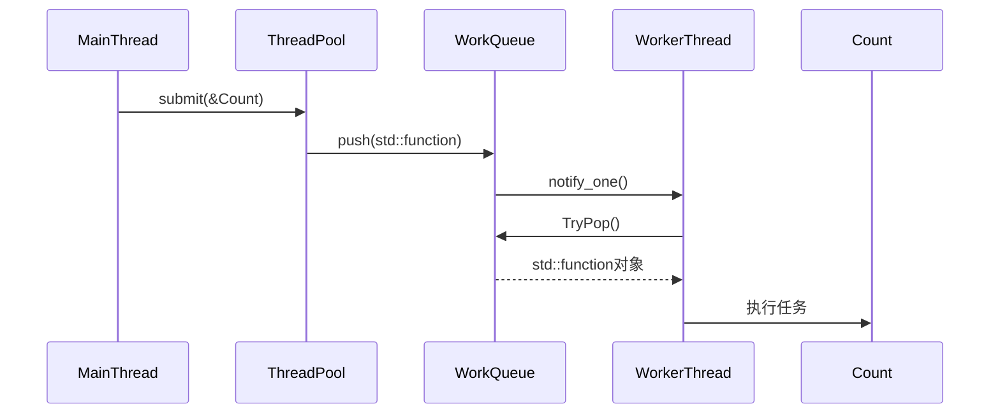

# 项目结构树

```cmd
SQLite/
├── include/               # 公共头文件（对外暴露的接口）
│   ├── thread_pool/       # 线程池模块
│   ├── orm/               # ORM模块
│   └── memory/            # 内存池模块（可选暴露接口）
├── src/                   # 实现代码
│   ├── thread_pool/       # 线程池实现
│   │   ├── thread_pool.cpp
│   │   └── task_allocator.cpp  # 内存池子模块
│   ├── orm/               # ORM实现
│   │   ├── db_connection.cpp
│   │   ├── table.cpp      # 表映射逻辑
│   │   └── query_builder.cpp   # SQL生成器
│   └── memory/            # 内存池实现（内部使用）
├── third_party/           # 第三方库（如SQLite源码）
├── tests/                 # 单元测试
│   ├── thread_pool_test.cpp
│   ├── orm_test.cpp
│   └── benchmark/         # 性能测试脚本
├── examples/              # 使用示例
│   ├── demo_orm.cpp       # ORM基础用法
│   └── demo_threadpool.cpp
├── CMakeLists.txt         # 构建配置
└── README.md              # 项目说明
```

# 线程池

## 线程池数据流图示

